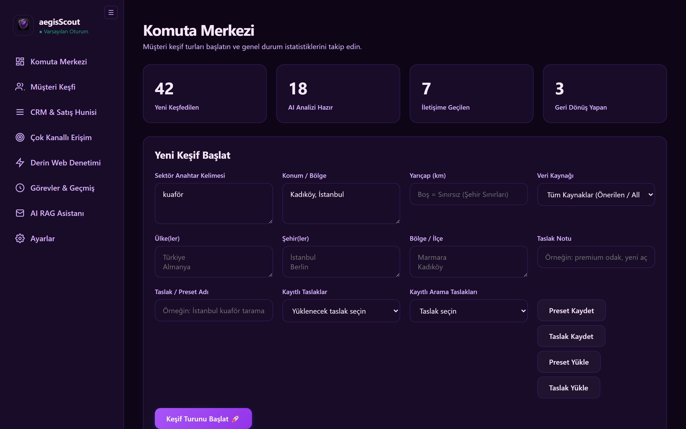
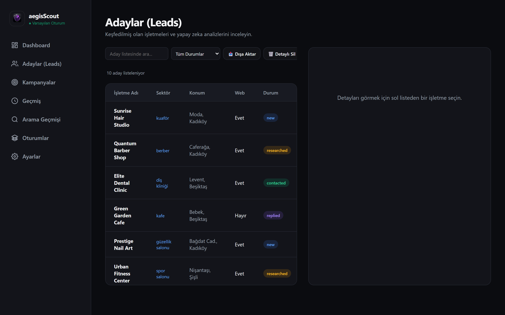
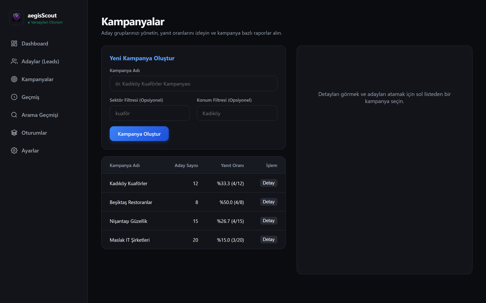
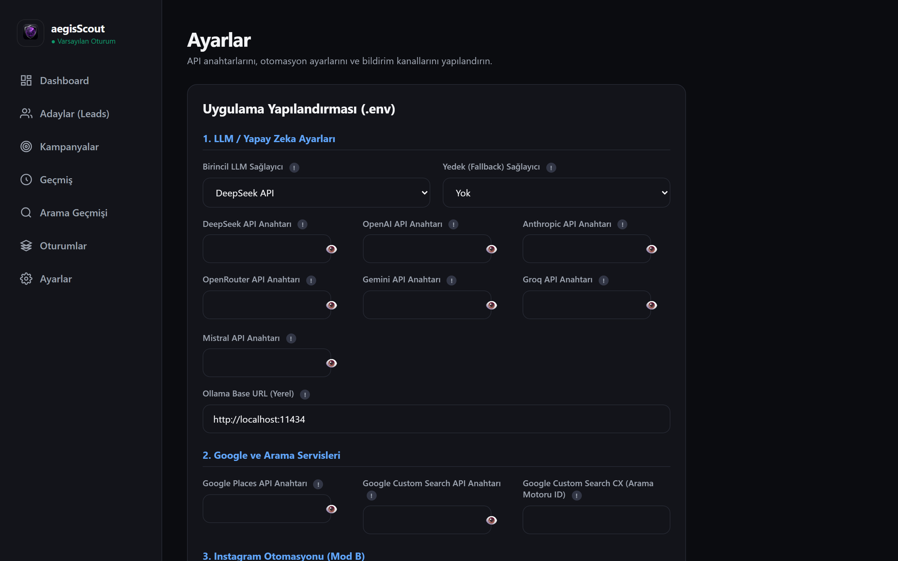

# aegisScout — İşletme Keşif, Analiz ve Satış Otomasyonu / Business Discovery, Analysis & Outreach Automation

aegisScout; web sitesi, mobil uygulama, tasarım ve dijital pazarlama hizmetleri sunan ajanslar ile freelancerlar için özel olarak tasarlanmış, **kendi bilgisayarınızda çalışan (self-hosted)**, modern ve son derece kapsamlı bir müşteri keşif, araştırma ve ilk temas (outreach) otomasyon platformudur.

---

## 🖼️ Application UI Screenshots

Here are actual screenshots of the desktop application's main panels:

### 📊 Dashboard & Discovery Radar


### 📋 Leads Manager


### 🎯 Campaigns Manager


### ⚙️ Settings & Configuration


---

# 🇹🇷 BÖLÜM 1: TÜRKÇE KULLANIM VE TEKNİK DOKÜMANTASYON

## 📌 Temel Özellikler

### 1. İşletme Keşif Motoru & OSINT Dizin Kazıyıcıları (Discovery Engine)
- **OpenStreetMap (OSM) Entegrasyonu (Ücretsiz & Limitsiz):** Overpass API aracılığıyla belirlenen bölge ve sektörlerdeki işletmeleri tarar. Gelişmiş sektör eşleştirme kuralları sayesinde gürültü verileri filtreler.
- **Sağlık & Uzman Dizin OSINT Derin Çıkarımı (DoktorSitesi & DoktorTakvimi):** "İstanbul psikolog" veya "diş hekimi" gibi aramalarda dizin indeks URL'lerini kaydetmek yerine dizin sayfalarını derinlemesine tarayarak gerçek bireysel uzman isimlerini, fotoğraflarını, telefon numaralarını, adreslerini ve biyografilerini ayıklar.
- **EmailOSINT & Sosyal Profil Avatarları:** `api.emailosint.org`, Gravatar ve Unavatar entegrasyonu sayesinde ters e-posta araştırması ve dairesel sosyal profil resmi çözünürlüğü sunar.
- **Tarama Derinliği Seçenekleri:** Keşif turları başlatılırken Hızlı (20 sonuç), Orta (50 sonuç), Detaylı (200+ sonuç) ve Derin OSINT seçenekleri ile çalıştırılabilir.
- **Google Places API Entegrasyonu (Gelişmiş/Opsiyonel):** Essentials API field mask özelliğini kullanarak işletme puanı, yorum sayıları ve adres verilerini ek ücretler oluşturmadan çeker.

### 2. Akıllı Araştırma, Web Scraping ve Görsel Denetim (Vision-Audit)
- Bulunan işletmelerin web sitelerini derinlemesine tarar.
- Playwright ve HTTP Web-Shot API yedeklemeleri sayesinde web sitelerinin ekran görüntülerini (Screen-Audit) kesintisiz kaydeder.
- Viewport mobil uyumluluğu, SSL sertifikası geçerliliği ve SEO meta etiketlerinin varlığı üzerinden **100 üzerinden otomatik Web Sitesi Kalite Skoru** hesaplar.
- Web sitesi üzerinden Instagram kullanıcı adlarını, telefon numaralarını ve iletişim e-postalarını tespit eder.

### 3. Çoklu API Key Rotasyonu ve SQLite WAL Mode Veritabanı
- **Çoklu API Key Rotasyonu:** Gemini, Serper, OpenAI gibi sağlayıcılarda virgülle ayrılmış birden fazla API anahtarı girildiğinde her istekte otomatik rotasyon yaparak kota ve oran limitlerini korur.
- **SQLite WAL Mode & Otomatik Kilit Önleme:** `PRAGMA journal_mode=WAL;` ve 30s kilit zamanaşımı ile tekli ve toplu silme işlemlerinde (`detaylı sil`, `tümünü sil`) kilitlenme ve autoflush hataları tamamen engellenmiştir.

### 4. Çoklu LLM Sağlayıcı Altyapısı (LLM Router)
- **Desteklenen Yapay Zeka Modelleri:**
  - **OpenRouter API** (Onlarca açık kaynaklı ve ticari modele erişim)
  - **Google Gemini API** (Yerel Gemini 2.5 Flash desteğiyle yüksek hızlı analiz)
  - **Groq API** (Llama-3.3-70b-versatile modeliyle ultra hızlı çıkarım)
  - **Mistral AI API** (Mistral Large desteğiyle kurumsal analizler)
  - **DeepSeek API** (Maliyet-etkin derin düşünme)
  - **OpenAI API** (GPT-4o & GPT-4o mini)
  - **Anthropic Claude API** (Claude 3.5 Haiku)
  - **Ollama** (Tamamen yerel ve ücretsiz offline LLM desteği)
- **Otomatik Hata Kurtarma (Failover Routing):** Birincil yapay zeka sağlayıcınızda kesinti yaşandığında, sistem otomatik olarak yedek (fallback) sağlayıcıya geçerek operasyonu kesintisiz sürdürür.
- **Kişiselleştirilmiş Taslak Üretimi:** `config.toml` dosyası üzerinden dil (Türkçe/İngilizce) ve erişim tonu (samimi, kurumsal, profesyonel) ayarlanabilir.

### 4. Kampanya Yönetimi (Campaign Management)
- Keşfedilen potansiyel müşterileri kampanya bazlı gruplandırabilme (Örnek: "Kadıköy Güzellik Salonları", "Beşiktaş Restoranlar").
- Sektör ve konuma göre adayları kampanyalara otomatik veya manuel atama seçeneği.
- Kampanya bazlı erişim istatistikleri ve yanıt (Conversion/Reply Rate) analizi.

### 5. Erişim Modları (Outreach & DM Automation)
- **Mod A (Yardımcı Erişim — Varsayılan & %100 Güvenli):** CLI veya GUI üzerinden tek tuşla işletmenin Instagram DM sayfasını tarayıcıda açar, AI tarafından üretilen özelleştirilmiş mesajı panoya kopyalar.
- **Mod B (Tam Otomasyon — Opsiyonel & Riskli):** Instagram API simülatörü (`instagrapi`) kullanarak doğrudan veritabanından oturum açıp otomatik DM gönderir. Günlük gönderim limitlerini (Rate Limiter) aşmadan arka planda çalışabilir.

### 6. Yanıt İzleme ve Bildirimler (Watcher Daemon)
- Arka planda gelen kutularını kontrol eden servis sayesinde, potansiyel müşterilerden gelen yanıtlar otomatik tespit edilir.
- Yanıt geldiğinde anında **Telegram Bot** veya **E-posta (SMTP)** bildirimleri tetiklenerek satış kaçırma riskini ortadan kaldırır.

### 7. Modern ve Gelişmiş Grafik Arayüz (GUI)
- PyWebView tabanlı, pürüzsüz geçişlere ve koyu tema (dark mode) tasarımına sahip masaüstü uygulaması.
- Kampanya yönetimi, canlı arama paneli, detaylı AI analiz ekranı ve yapılandırma sekmeleriyle eksiksiz kontrol sunar.
- Çift modlu çalışma: Parametresiz başlatıldığında (`aegisScout.exe` veya `python main.py` doğrudan çalıştırıldığında) Windows konsol pencerelerini arka planda gizleyerek yerel bir GUI uygulaması gibi açılır; argümanlarla çalıştırıldığında ise CLI modunda çalışmaya devam eder.

### 8. Optimizasyon ve Kararlılık (Optimizasyon & Stabilizasyon)
- **Küçük Paket Boyutu**: PyInstaller excludes listesi optimize edilerek `.exe` dosya boyutu **%24.4 oranında** (57 MB'tan 43 MB'a) düşürüldü.
- **Modüler Bağımlılıklar**: `instagrapi` gibi ağır ve opsiyonel paketler dinamik/tembel (lazy import) olarak yüklenir, temel Mod A kurulumlarında ve başlatmada hata alınması engellenir.
- **Güvenli PyWebView İletişimi**: `evaluate_js` veri aktarımları `json.dumps` ile güvenli hale getirilerek JS tarafında oluşabilecek SyntaxError vb. donma hataları engellendi.

### 9. Yerel E-posta Doğrulama (Local Email Verifier — V2)
- **SMTP El Sıkışma (Handshake) Simülasyonu:** Bulunan e-posta adresini regex format, disposable domain kontrolü, DNS MX sorgulama ve soket tabanlı SMTP el sıkışması ile 4 aşamada yerel olarak doğrular.
- **Ücretsiz & API'siz:** Hiçbir harici API anahtarı gerektirmez. Tüm kontroller Python socket ve dnspython kütüphanesi ile gerçekleştirilir.
- **Geçici E-posta Tespiti:** 30+ bilinen disposable e-posta sağlayıcısını kara listede tutar; ek dosya (`data/disposable_domains.txt`) ile genişletilebilir.

### 10. Waterfall Zenginleştirme Basamakları (Enrichment Cascade — V2)
- **Kademeli E-posta Keşfi:** Sırasıyla web sitesi kazıma, arama motoru sorgusu (Google/DuckDuckGo), Instagram biyografi kazıma ve e-posta doğrulama adımlarını otomatik olarak çalıştırır.
- **Akıllı Durdurma:** Herhangi bir adımda e-posta bulunursa sonraki adımlar atlanır, gereksiz API kullanımı engellenir.
- **Yapılandırılabilir:** `data/waterfall_config.json` dosyası üzerinden her adım etkinleştirilip/devre dışı bırakılabilir ve arama sorgu şablonları özelleştirilebilir.
- **API'siz Arama Yedekleme:** Google Custom Search API anahtarı yoksa otomatik olarak ücretsiz DuckDuckGo aramasına düşer.

### 11. Çoklu-Ajan AI Taslak Üretimi (Multi-Agent AI Draft — V2)
- **3 Ajanlı İş Akışı:** Inspector (teknik fırsat tespiti), Copywriter (kişiselleştirilmiş taslak yazımı) ve Editor (doğal dil düzeltmesi) olmak üzere üç yapay zeka ajanı sırayla çalışır.
- **RAG Destekli Kişiselleştirme:** Yerel bilgi tabanında sektöre uygun referanslar ve örnek vaka çalışmaları aranarak taslak içeriği zenginleştirilir.
- **Emoji ve Klişe Filtreleme:** Editor ajanı, AI tarafından üretilen taslaklardaki yapay zeka jargonu, klişe selamlaşmalar ve uydurma istatistikleri temizler.

### 12. Yerel RAG Bilgi Tabanı (Local RAG Knowledge Base — V2)
- **Çift Motorlu Arama:** Saf Python TF-IDF algoritması (çevrimdışı, hiçbir harici bağımlılık gerektirmez) ve opsiyonel embedding (Ollama veya Gemini API) ile benzerlik araması yapar.
- **Çoklu Format Desteği:** `data/knowledge_base/` klasöründeki `.txt`, `.md` ve `.pdf` dosyalarını otomatik olarak tarar, parçalara ayırır (chunk) ve indeksler.
- **Otomatik Embedding Fallback:** Embedding hesaplanamazsa TF-IDF cosine similarity'ye düşer; kesintisiz çalışma sağlar.

### 13. SMTP Hesap Havuzu ve Hız Sınırlama (SMTP Pool & Rate Limiting — V2)
- **Otomatik Hesap Rotasyonu:** Veritabanında tanımlı birden çok SMTP hesabı arasında en az kullanılanı seçerek yük dağıtımı yapar.
- **Saatlik Limit Yönetimi:** Her SMTP hesabı için saatte maksimum 5 e-posta gönderim limiti uygulanır; limit aşımında otomatik olarak sıradaki hesaba geçer.
- **Şifreli Kimlik Bilgileri:** SMTP şifreleri veritabanında AES-256 Fernet ile şifrelenir.

### 14. Soğuk E-posta Motoru ve Takip Dizileri (Cold Email & Follow-ups — V2)
- **Çok Aşamalı Sıralı E-posta:** İlk e-posta (initial), 1. takip (3 gün sonra) ve 2. takip (7 gün sonra) olmak üzere kampanya bazında yapılandırılabilir takip dizileri.
- **Akıllı Atlama:** Potansiyel müşteriden gelen yanıt (inbound) algılandığında takip e-postaları otomatik olarak atlanır.
- **Kampanyaya Özel Şablonlar:** Her kampanya kendi konu satırı, e-posta gövdesi ve gecikme sürelerini taşır.
- **IMAP Tabanlı Gelen Kutusu İzleme:** Tüm aktif SMTP hesaplarının IMAP gelen kutuları taranarak yanıtlar otomatik tespit edilir.

### 15. P2P E-posta Isıtma (Warmup Engine — V2)
- **Gönderen-Alıcı Eşleştirmesi:** Rastgele seçilen iki aktif SMTP hesabı arasında doğal e-posta trafiği simüle eder.
- **Spam Kurtarma:** IMAP üzerinden spam/junk klasörleri taranır, warmup e-postaları otomatik olarak Gelen Kutusu'na taşınır ve okunmuş olarak işaretlenir.
- **AI veya Şablon Tabanlı İçerik:** Gemini API varsa yapay zeka ile doğal dilde e-posta üretir; yoksa offline şablon havuzundan rastgele seçim yapar.
- **Otomatik Yanıt Döngüsü:** Alıcı, gönderene otomatik yanıt oluşturur; her iki taraf da gelen e-postaları okur, yıldızlar ve spam'dan kurtarır.
- **İstatistik Takibi:** `data/warmup_stats.json` dosyasına gönderim, yanıt, spam kurtarma ve yıldız sayıları kaydedilir.

### 16. Multimodal Ekran Denetimi (Screen Audit — V2)
- **Playwright ile Otomatik Ekran Görüntüsü:** Adayın web sitesinin masaüstü görünümü headless Chromium ile yakalanır ve `data/screenshots/` klasörüne kaydedilir.
- **Gemini Vision AI ile Görsel Analiz:** Ekran görüntüsü Gemini Vision API'ye gönderilerek mobil uyumluluk, kontrast hataları ve dönüşüm optimizasyonu fırsatları tespit edilir.
- **Yerel Sezgisel Yedek:** Gemini API anahtarı yoksa sayfa hızı, kırık link ve CTA eksikliği gibi metrikler üzerinden kalite skoru hesaplanır.
- **Outreach Hook Üretimi:** Tespit edilen görsel hatalara dayanarak yüksek dönüşümlü, kişiselleştirilmiş bir outreach hook'u otomatik oluşturulur.

### 17. WhatsApp Web ve LinkedIn Playwright Otomasyonu (V2)
- **Kalıcı Tarayıcı Profilleri:** WhatsApp Web ve LinkedIn için ayrı Playwright persistent context profilleri kullanılır, QR kodu veya giriş bilgileri bir kez girilir.
- **WhatsApp Web Otomatik Mesaj:** Telefon numarasına doğrudan WhatsApp Web üzerinden otomatik mesaj gönderir.
- **LinkedIn Bağlantı ve Mesaj Otomasyonu:** Hedef LinkedIn profiline giderek "Bağlantı Kur" veya "Mesaj Gönder" butonlarını otomatik tespit eder.
- **Anti-Bot Koruması:** headless=False modunda çalışarak bot tespit riskini azaltır.

### 18. Arka Plan Görev Kuyruğu (Task Queue — V2)
- **Singleton Async Kuyruk:** Tüm arka plan görevleri tek bir asyncio event loop üzerinde sırayla çalışır.
- **Görev Yaşam Döngüsü:** Her görev `pending -> running -> completed / failed / cancelled` durumları arasında geçiş yapar; duraklatma ve devam ettirme desteği vardır.
- **İlerleme Takibi:** Çalışan görevler yüzde bazında ilerleme bildirir; tüm görevlerin durumu listelenebilir.
- **İptal ve Duraklatma:** Çalışan veya bekleyen görevler güvenle iptal edilebilir veya duraklatılabilir.

### 19. Gelişmiş Ürün Yol Haritası ve Platform Güncellemeleri (V3 Roadmap)
- **AI Sağlayıcı Bağımsızlığı:** Cloud AI sağlayıcılar (Gemini, OpenAI, Claude, Groq, DeepSeek, Mistral, OpenRouter) birincil öncelikli kılınmış; Ollama isteğe bağlı yerel yedek seçeneği olarak yapılandırılmıştır.
- **Sıfır Maliyetli Yerel E-Posta Doğrulayıcı (`email_verifier.py`):** Regex formatı, geçici (disposable) domain engelleme veritabanı, DNS MX kaydı sorgulama ve SMTP handshake simülasyonu (`HELO`, `MAIL FROM`, `RCPT TO`) ile e-posta göndermeden 4 katmanlı yerel doğrulama.
- **Çok Kanallı WhatsApp & LinkedIn Erişimi (`assisted_mode.py`):** WhatsApp Web (`wa.me`) mesaj yönlendiricisi, panoya kopyalama ve LinkedIn şirket/profil erişim yardımcısı.
- **Anti-Bot HTTP/SOCKS5 Proxy Havuzu (`proxy_pool.py`):** HTTP/SOCKS5 proxy rotasyonu, canlılık/gecikme testi (latency check) ve otomatik havuz yenileme.
- **Açılır/Kapanır (Collapsible) Sol Menü & 9 Dilde Tam i18n Desteği:** `#sidebar-toggle-btn` butonu, daraltılmış mod araç ipuçları, 9 dilde (Türkçe, İngilizce, Almanca, İspanyolca, Fransızca, Arapça, Çince, Rusça, Hintçe) dinamik çeviri ve 12 temada renk kontrastı optimizasyonları.

### 20. Derin OSINT ve Çoklu Sosyal Medya Taraması (V4/V5)
- **Genişletilmiş Platform Desteği:** Web sitelerinden Instagram, Facebook, LinkedIn, Twitter/X, TikTok, Telegram, YouTube, GitHub, Medium, Substack, Behance, Dribbble, Snapchat, Spotify, SoundCloud, Twitch bağlantılarını otomatik tespit eder.
- **TikTok & Sosyal Profil Tespiti:** Sosyal profil ağlarını analiz ederek doğrudan iletişim adreslerini ve şirket hesaplarını eşleştirir.

### 21. Zamanlanmış Görev Motoru (Cron Manager — V4/V5)
- **Zamanlanmış Otomatik Görevler:** Periyodik müşteri keşfi, otomatik takip e-postaları, gelen kutusu denetimi ve veri senkronizasyonunu arka planda düzenli aralıklarla otomatik çalıştırır.

### 22. SQLite WAL ve Yüksek Başarımlı Veritabanı (V5)
- **WAL Modu ve İndeksleme:** Veritabanı performansı WAL (Write-Ahead Logging) ve özel SQLite indeksleri ile güçlendirilmiş, eşzamanlı okuma/yazma işlemleri hızlandırılmıştır.
- **Otomatik Tekilleştirme (Deduplication):** Tekrarlayan adres ve alan adı girdileri veritabanı seviyesinde otomatik olarak engellenir.

---


## 🛠️ Kurulum ve Yapılandırma

### 1. Sistem Gereksinimleri
- Python 3.11 veya üzeri
- `uv` paket yöneticisi (Tavsiye edilen hızlı kurulum aracı)

### 2. Kurulum Adımları
Projeyi klonladıktan sonra dizine gidip aşağıdaki komutlarla ilgili modları kurabilirsiniz:

```bash
# Temel Kurulum (Sadece Mod A - Manuel Outreach)
uv sync

# Masaüstü Grafik Arayüzü (GUI) dahil kurulum
uv sync --extra gui

# Tam Otomatik Erişim (Mod B) dahil kurulum
uv sync --extra mod-b

# Geliştirici ve test araçlarıyla birlikte kurulum
uv sync --extra dev
```

> **Not:** `uv` kullanmıyorsanız standart kurulum için `pip install -e .` komutunu çalıştırabilirsiniz.

### 3. Yapılandırma
1. Proje kök dizininde `.env` dosyasını oluşturun:
   ```bash
   copy .env.example .env
   ```
2. `.env` dosyasını açıp kullanmak istediğiniz LLM ve arama sağlayıcılarının API anahtarlarını ve ek parametreleri girin:
   - `OPENROUTER_API_KEY`
   - `GEMINI_API_KEY`
   - `GROQ_API_KEY`
   - `MISTRAL_API_KEY`
   - `DEEPSEEK_API_KEY`
   - `OPENAI_API_KEY`
   - `ANTHROPIC_API_KEY`
   - `GOOGLE_PLACES_API_KEY`
   - `LLM_TIMEOUT` (Yapay zeka istekleri için zaman aşımı süresi - saniye)
   - `NOTIFY_EMAIL_RECIPIENT` (Bildirimlerin gönderileceği e-posta adresi)
3. Proje ayarları için `config.toml` dosyasını kopyalayın ve düzenleyin:
   ```bash
   copy config\config.example.toml config\config.toml
   ```

### 🔒 Güvenlik ve Sıkılaştırma (Security & Hardening)
- **Oturum Şifreleme (Session Encryption):** Mod B oturum verileri (`data/sessions/session.json`) AES-256 (Fernet) ile güçlü bir şekilde şifrelenir. Şifreleme anahtarı `.env` dosyasındaki `INSTAGRAM_SESSION_ENCRYPTION_KEY` değişkeninden veya otomatik olarak `0600` izinleriyle oluşturulan `data/.fernet_key` dosyasından okunur. Geçersiz şifre anahtarı kullanıldığında sistem hata fırlatır ve asla şifresiz düz metin okumaya geri dönmez (no plaintext fallback).
- **GUI Sır Sınırı (Secrets Boundary):** PyWebView arayüzüne bağlanan Python API (`is_configured` / `get_settings`) kesinlikle hiçbir API anahtarı veya şifreyi JavaScript tarafına sızdırmaz. GUI formları üzerinden girilen gizli anahtarlar doğrudan `.env` dosyasına yazılır fakat JS köprüsüne asla geri döndürülmez.

---

## 💻 Kullanım Kılavuzu (CLI & GUI)

### Masaüstü Arayüzünü Başlatma
Doğrudan GUI ekranını açmak için hiçbir parametre vermeden komutu çalıştırmanız veya `dist/aegisScout.exe` dosyasına çift tıklamanız yeterlidir:
```bash
aegisScout
```

### CLI Temel Komutları

#### 1. İşletme Keşfetme
```bash
# Belirli konum ve sektör araması yap
aegisScout discover --sector "kuaför" --location "Kadıköy, İstanbul" --radius 5

# Google Places sağlayıcısı ile arama yap
aegisScout discover --sector "klinik" --location "Nişantaşı" --provider google_places
```

#### 2. Kampanya Yönetimi
```bash
# Yeni kampanya oluştur
aegisScout campaign create --name "Kadıköy Güzellik Salonları" --sector "kuaför" --location "Kadıköy"

# Kampanya listesi ve başarı oranlarını göster
aegisScout campaign list

# Mevcut adayları kampanyaya filtreleriyle otomatik ata
aegisScout campaign assign --campaign-id 1 --auto-filter
```

#### 3. Araştırma ve AI Analizi Çalıştırma
```bash
# 1 nolu adayı derinlemesine araştır ve web sitesini analiz et
aegisScout research --lead-id 1

# Adayı zorla yeniden araştır
aegisScout research --lead-id 1 --force
```

#### 4. İnceleme ve Erişim (Review & Send)
```bash
# Keşfedilen tüm adayları ve üretilen AI taslaklarını interaktif incele
aegisScout review

# Mod A aracılığıyla adaya manuel mesaj gönder (panoya kopyalar, tarayıcıda açar)
aegisScout send --lead-id 1
```

#### 5. Verileri Dışa Aktarma
```bash
# Veritabanındaki adayları CSV olarak dışa aktar
aegisScout export --output data/exports/leads.csv

# Belirli bir kampanya veya duruma göre filtreleyerek dışa aktar
aegisScout export --campaign-id 1 --status contacted --output data/exports/campaign_1.csv
```

#### 6. Waterfall E-posta Zenginleştirme (V2)
```bash
# Belirli bir lead için waterfall basamaklarını çalıştır
aegisScout waterfall --lead-id 1

# Adımlar: web scraping -> arama sorgusu -> Instagram bio -> e-posta doğrulama
```

#### 7. Multimodal Ekran Denetimi (V2)
```bash
# Adayın web sitesini Playwright ile görüntüle, Gemini Vision ile analiz et
aegisScout audit --lead-id 1

# Kalite skoru, hata raporu ve kişiselleştirilmiş outreach hook üretir
```

#### 8. E-posta Doğrulama (V2)
```bash
# Bir e-posta adresini SMTP handshake ile yerel olarak doğrula
aegisScout verify "ornek@firma.com"

# Format, disposable domain, DNS MX ve SMTP olmak üzere 4 aşamalı kontrol
```

#### 9. P2P E-posta Isıtma (V2)
```bash
# İki SMTP hesabı arasında warmup döngüsü başlat
aegisScout warmup

# Doğal dilde e-posta gönderimi, spam kurtarma ve otomatik yanıt içerir
```

#### 10. Arka Plan Görev Yönetimi (V2)
```bash
# Tüm arka plan görevlerini listele
aegisScout tasks list

# Belirli bir görevi iptal et
aegisScout tasks cancel <task_id>
```

---

## 🔒 Güvenlik ve Gizlilik Politikası
- **Yerel Veritabanı:** Keşfedilen tüm adaylar, mesaj geçmişleri, analizler ve ayarlarınız sadece bilgisayarınızdaki yerel SQLite veritabanında (`data/aegisScout.db`) saklanır. Herhangi bir harici sunucuya veya bulut sistemine aktarılmaz.
- **Hassas Bilgilerin Korunması:** API anahtarları, şifreler ve Instagram oturum verileri kesinlikle kaynak kod içine gömülmez. Tüm gizli değişkenler `.env` dosyası üzerinden okunur. 
- **Veri Şifreleme:** Instagram hesap şifreleri ve hassas kimlik bilgileri, veritabanında AES-256 tabanlı Fernet şifreleme algoritmasıyla kriptolanmış olarak tutulur.

---

## ⚖️ Kullanım Şartları ve Sorumluluk Reddi
- **Instagram ToS Warning:** Mod B (Tam Otomasyon) özelliğinin kullanımı Meta/Instagram Kullanım Koşulları'nı (ToS) ihlal eder. Otomasyon tespit mekanizmaları nedeniyle hesaplarınızın kısıtlanması veya kapatılması riski mevcuttur. aegisScout geliştiricileri bu aracın otomatik kullanımından doğabilecek hesap kayıplarından veya yasal sorunlardan sorumluluk kabul etmez. Otomasyon modunu kullanırken **yedek/ikincil hesaplar** kullanmanız ve günlük limitleri (maks. 15-20 mesaj) aşmamanız önerilir.
- **Yasal Uyarı — KVKK ve İYS:** Bu araç ile toplanan kişisel verilerin (telefon numarası, e-posta vb.) işlenmesi, Kişisel Verilerin Korunması Kanunu (KVKK) kapsamına girebilir. Ayrıca, reklam amaçlı elektronik ileti göndermeden önce İleti Yönetim Sistemi (İYS) kapsamındaki mevzuata uyulması zorunludur. **Bu aracı kullanmadan önce bir hukuk danışmanına danışmanız önerilir.**

---
---

# 🇺🇸 SECTION 2: ENGLISH USER GUIDE & TECHNICAL DOCUMENTATION

## 📌 Core Features

### 1. Business Discovery Engine
- **OpenStreetMap (OSM) Integration (Free & Unlimited):** Scans businesses in specified sectors and locations using the Overpass API. Employs smart tag-mapping configurations to filter out irrelevant data.
- **Google Places API Integration (Advanced/Optional):** Utilizes the Essentials API with field masks to fetch ratings, review counts, and addresses without incurring unnecessary costs.

### 2. Intelligent Scraper & Research Module
- Crawls target websites deeply to verify contact information and online presence.
- Automatically calculates a **Website Quality Score (out of 100)** by analyzing mobile viewport compatibility, SSL validity, and SEO meta tags.
- Extracts Instagram handles, phone numbers, and contact emails directly from website sources.
- Double-checks and validates crawled social handles via Google Custom Search API lookups.

### 3. Multi-LLM Provider Architecture (LLM Router)
- **Supported AI Providers:**
  - **OpenRouter API** (Accesses dozens of open-source and commercial models seamlessly)
  - **Google Gemini API** (High-speed content generation via Gemini 2.5 Flash)
  - **Groq API** (Ultra-low latency generation using Llama-3.3-70b-versatile)
  - **Mistral AI API** (Enterprise-grade reasoning using Mistral Large)
  - **DeepSeek API** (Deep reasoning with minimal costs)
  - **OpenAI API** (GPT-4o & GPT-4o mini)
  - **Anthropic Claude API** (Claude 3.5 Haiku)
  - **Ollama** (Completely offline, private, and free local model support)
- **Automatic Failover Routing:** If your primary AI provider fails, the system automatically redirects requests to a secondary configured fallback provider.
- **Customized Prompt Templates:** Configurable language (Turkish/English) and communication tone (casual, professional, warm) customizable in `config.toml`.

### 4. Campaign Management
- Group leads into structured campaigns (e.g., "Chelsea Hair Salons", "Downtown Restaurants").
- Assign leads to campaigns manually or automatically using campaign-level sector and location filters.
- Real-time campaign stats and conversion (Reply Rate) analytics.

### 5. Smart Outreach Modes
- **Mode A (Assisted Outreach — Default & 100% Safe):** Copies the generated message to your clipboard and opens the lead's Instagram DM profile in your default browser with a single click.
- **Mode B (Full Automation — Optional & Risky):** Log in and send direct messages automatically from your database using the simulated Instagram API (`instagrapi`). Operates in the background with local database rate limiters.

### 6. Inbox Watcher & Notification Daemon
- A background worker scans your inbox and detects responses from outreach leads.
- Automatically sends instant alerts via **Telegram Bot** or **Email (SMTP)** when a lead replies.

### 7. Modern Desktop GUI
- A sleek, responsive PyWebView desktop dashboard built with premium dark-mode styling and smooth animations.
- Fully controls campaigns, settings, lead discovery, and AI analysis pipelines.
- **Dual Startup Mode:** Double-clicking `dist/aegisScout.exe` (or running `python main.py` without arguments) automatically hides console terminal windows on Windows. Running with CLI arguments bypasses the GUI and executes the corresponding CLI commands.

### 8. Optimization & Stability
- **Lightweight Executable**: PyInstaller exclusions have been optimized to reduce the `.exe` package size by **24.4%** (from 57 MB to 43 MB).
- **Modular Dependencies**: Optional libraries like `instagrapi` are loaded lazily. Standard installs without `mod-b` can startup and run Mode A safely.
- **Robust IPC**: Escapes evaluate_js communication safely using JSON serialization, preventing WebView script syntax errors.

### 9. Local Email Verification (V2)
- **SMTP Handshake Simulation:** Verifies email addresses through 4 local stages: regex format check, disposable domain lookup, DNS MX resolution, and socket-based SMTP handshake.
- **Zero API Cost:** All checks run locally using Python sockets and dnspython. No external API keys required.
- **Disposable Detection:** Maintains a built-in blocklist of 30+ known disposable providers, extendable via `data/disposable_domains.txt`.

### 10. Waterfall Enrichment Cascade (V2)
- **Sequential Email Discovery:** Runs website scraping, search engine query (Google/DuckDuckGo), Instagram bio scraping, and email verification in a configurable cascade.
- **Smart Early Exit:** If an email is found at any step, subsequent steps are skipped automatically to conserve API credits.
- **Configurable Pipeline:** Each step can be enabled or disabled in `data/waterfall_config.json` with customizable search query templates.
- **API-Free Fallback:** Falls back to free DuckDuckGo HTML search when Google Custom Search API keys are not configured.

### 11. Multi-Agent AI Draft Generation (V2)
- **3-Agent Workflow:** A pipeline of Inspector (technical opportunity spotting), Copywriter (personalized draft writing), and Editor (natural language cleanup) agents collaborate sequentially.
- **RAG-Enhanced Personalization:** Searches the local knowledge base for relevant case studies and portfolio references to enrich draft content.
- **Anti-Cliché Filtering:** The Editor agent strips AI jargon, cliché salutations, and fabricated statistics from generated drafts.
- **Configurable Language & Tone:** Supports Turkish/English language and warm/professional/casual tone settings in `config.toml`.

### 12. Local RAG Knowledge Base (V2)
- **Dual Search Engine:** Pure Python TF-IDF (fully offline, zero dependencies) with optional embedding-based search via Ollama or Gemini API for semantic similarity.
- **Multi-Format Support:** Automatically scans, chunks, and indexes `.txt`, `.md`, and `.pdf` files from `data/knowledge_base/`.
- **Graceful Fallback:** Falls back to TF-IDF cosine similarity when embedding models are unavailable, ensuring uninterrupted operation.
- **Persistent Index:** The processed index is cached in `data/kb_vectors.json` and does not require re-indexing on restart.

### 13. SMTP Pool & Rate Limiting (V2)
- **Automatic Account Rotation:** Selects the least recently used SMTP account from the pool for balanced load distribution.
- **Per-Account Rate Limits:** Enforces a maximum of 5 emails per hour per SMTP account. Automatically rotates to the next account when the limit is reached.
- **Encrypted Credentials:** SMTP passwords are encrypted at rest using AES-256 Fernet and decrypted at runtime.
- **Global Fallback:** Falls back to global SMTP settings from `.env` when no database accounts are configured.

### 14. Cold Email Engine & Follow-Up Sequences (V2)
- **Multi-Stage Email Sequences:** Per-campaign configurable follow-up chains: initial email, follow-up 1 (3-day delay), and follow-up 2 (7-day delay).
- **Smart Skip Logic:** Automatically skips follow-ups when an inbound reply is detected from the lead, preventing unnecessary messages.
- **Campaign-Specific Templates:** Each campaign carries its own subject lines, email bodies, and delay durations (`followup_delay_1_days`, `followup_delay_2_days`).
- **IMAP Inbox Monitoring:** Polls IMAP inboxes across all active SMTP accounts to automatically detect and deduplicate replies.

### 15. P2P Email Warmup Engine (V2)
- **Random Sender-Receiver Pairing:** Simulates natural email traffic between two randomly selected active SMTP accounts.
- **Spam Rescue:** Automatically scans Spam/Junk folders via IMAP, moves warmup emails to Inbox, and marks them as read.
- **AI or Template Content:** Generates natural language email content via Gemini API when available, or falls back to an offline template pool.
- **Auto-Reply Cycle:** The receiver automatically generates a reply, and both sides mark incoming messages as read, starred, and rescued from spam.
- **Statistics Tracking:** Sends, replies, spam rescues, and stars are logged to `data/warmup_stats.json`.

### 16. Multimodal Website Screen Audit (V2)
- **Playwright Screenshot Capture:** Takes a desktop viewport screenshot of the lead's website using headless Chromium, saved to `data/screenshots/`.
- **Gemini Vision AI Analysis:** Sends the screenshot to Gemini Vision API to detect mobile responsiveness issues, contrast errors, layout flaws, and conversion optimization opportunities.
- **Local Heuristic Fallback:** Falls back to page speed, broken links, and CTA presence metrics for quality scoring when Gemini API is unavailable.
- **Outreach Hook Generation:** Automatically crafts a high-converting, personalized outreach hook based on the specific visual flaws discovered.

### 17. WhatsApp Web & LinkedIn Browser Automation (V2)
- **Persistent Browser Profiles:** Separate Playwright persistent context profiles for WhatsApp Web and LinkedIn. QR codes and login credentials are entered once and reused.
- **WhatsApp Web Auto-Send:** Sends messages directly via WhatsApp Web using the target phone number. Country code (90 for Turkey) is appended automatically.
- **LinkedIn Connect & Message Automation:** Navigates to target profiles, automatically detects "Connect" or "Message" buttons, and sends connection requests with personalized notes or direct messages.
- **Anti-Detection Safeguards:** Runs in headful (non-headless) mode to reduce bot detection risk. Scans "More" dropdown menus for hidden connect options.

### 18. Background Task Queue (V2)
- **Singleton Async Queue:** All background tasks run sequentially on a single asyncio event loop for efficient resource use.
- **Task Lifecycle:** Each task transitions through `pending -> running -> completed / failed / cancelled`. Pause and resume are supported.
- **Progress Tracking:** Running tasks report percentage-based progress. All task statuses can be listed via the CLI.
- **Safe Cancellation:** Running or pending tasks can be safely cancelled or paused from the command line.

### 19. Deep OSINT & Multi-Platform Social Discovery (V4/V5)
- **Extended Social Mining:** Automatically extracts Instagram, Facebook, LinkedIn, Twitter/X, TikTok, Telegram, YouTube, GitHub, Medium, Substack, Behance, Dribbble, Snapchat, Spotify, SoundCloud, Twitch links from target websites.
- **Deep Contact Association:** Cross-verifies social profiles to map target leads to their direct corporate touchpoints.

### 20. Automated Cron Task Scheduler (V4/V5)
- **Cron Manager:** Periodically schedules discovery, follow-ups, inbox scanning, and data synchronization without manual intervention.

### 21. SQLite WAL & Database Performance Boost (V5)
- **WAL Mode & Custom Indexes:** Employs Write-Ahead Logging (WAL) and optimized SQL indexing for ultra-fast query execution and concurrent read/writes.
- **Automated Deduplication:** Prevents duplicate leads and domains at the database query layer.

---

## 🛠️ Installation & Setup

### 1. Requirements
- Python 3.11 or higher
- `uv` package manager (recommended for fast installation)

### 2. Install Instructions
Clone the repository, navigate into the project directory, and choose your install flags:

```bash
# Basic setup (Mode A only - Assisted Outreach)
uv sync

# Install with Desktop GUI dashboard
uv sync --extra gui

# Install with Full Automation (Mode B)
uv sync --extra mod-b

# Install with developer and testing dependencies
uv sync --extra dev
```

> **Note:** Standard installation without `uv` can be completed using `pip install -e .`

### 3. Environment Setup
1. Create a local `.env` file from the template:
   ```bash
   copy .env.example .env
   ```
2. Open `.env` and fill in your API credentials:
   - `OPENROUTER_API_KEY`
   - `GEMINI_API_KEY`
   - `GROQ_API_KEY`
   - `MISTRAL_API_KEY`
   - `DEEPSEEK_API_KEY`
   - `OPENAI_API_KEY`
   - `ANTHROPIC_API_KEY`
   - `GOOGLE_PLACES_API_KEY`
3. Set up the config file:
   ```bash
   copy config\config.example.toml config\config.toml
   ```

---

## 💻 Usage Guide (CLI & GUI)

### Launching the GUI
To start the desktop application window directly, run the command without arguments or double-click the `dist/aegisScout.exe` file:
```bash
aegisScout
```

### Essential CLI Commands

#### 1. Business Discovery
```bash
# Scan a specific sector in a location
aegisScout discover --sector "barber" --location "Chelsea, London" --radius 5

# Discover businesses using Google Places API
aegisScout discover --sector "dentist" --location "Manhattan" --provider google_places
```

#### 2. Campaign Management
```bash
# Create a new campaign
aegisScout campaign create --name "Chelsea Hair Salons" --sector "hair" --location "Chelsea"

# List campaigns and their performance
aegisScout campaign list

# Auto-assign matching unassigned leads using campaign filters
aegisScout campaign assign --campaign-id 1 --auto-filter
```

#### 3. Lead Research & AI Analysis
```bash
# Perform deep scraping and generate AI message draft for a lead
aegisScout research --lead-id 1

# Force re-analyze a lead
aegisScout research --lead-id 1 --force
```

#### 4. Review & Outreach
```bash
# Review leads and AI outreach drafts interactively
aegisScout review

# Execute Mode A outreach for a lead
aegisScout send --lead-id 1
```

#### 5. Data Export
```bash
# Export all leads to a CSV file
aegisScout export --output data/exports/leads.csv

# Export filtered leads
aegisScout export --campaign-id 1 --status contacted --output data/exports/campaign_1.csv
```

#### 6. Waterfall Email Enrichment (V2)
```bash
# Run the waterfall cascade for a specific lead
aegisScout waterfall --lead-id 1

# Steps: website scrape -> search query -> Instagram bio -> email verify
```

#### 7. Multimodal Screen Audit (V2)
```bash
# Capture website screenshot and analyze with Gemini Vision
aegisScout audit --lead-id 1

# Generates quality score, design flaw report, and outreach hook
```

#### 8. Email Verification (V2)
```bash
# Verify an email address locally via SMTP handshake
aegisScout verify "user@example.com"

# 4-stage check: format, disposable domain, DNS MX, SMTP
```

#### 9. P2P Email Warmup (V2)
```bash
# Run a warmup cycle between two SMTP accounts
aegisScout warmup

# Generates natural emails, rescues from spam, and auto-replies
```

#### 10. Background Task Management (V2)
```bash
# List all background tasks with status and progress
aegisScout tasks list

# Cancel a specific running or pending task
aegisScout tasks cancel <task_id>
```

---

## 🔒 Security & Privacy Rules
- **Local Databases:** All leads, messages, settings, and credentials remain private and are stored solely in your local SQLite database (`data/aegisScout.db`). No cloud uploads or external trackers are involved.
- **Protected Secrets:** No API keys or credentials are ever hardcoded in the codebase. All variables are loaded dynamically from your local `.env`.
- **Credential Encryption:** High-risk credentials (e.g. Instagram passwords, session keys) are encrypted using AES-256 Fernet tokens before being written to the database.

---

## ⚖️ Terms of Use & Disclaimer
- **Instagram ToS Warning:** Using Mode B (Full Automation) violates Meta/Instagram's Terms of Service. There is an inherent risk of temporary restrictions or permanent account bans. The developers of aegisScout assume no liability for account losses, bans, or penalties. It is highly recommended to use **secondary/throwaway accounts** and adhere strictly to daily messaging safety limits (max 15-20 messages/day).
- **Compliance Warning — GDPR & local laws:** Scraping personal contact details or sending promotional messages to cold businesses may be subject to GDPR or local direct marketing compliance frameworks. **Ensure you consult with a legal professional before initiating commercial messaging campaigns.**

---

## 📄 License
This project is licensed under the **MIT License**. For more information, see the [LICENSE](LICENSE) file.
