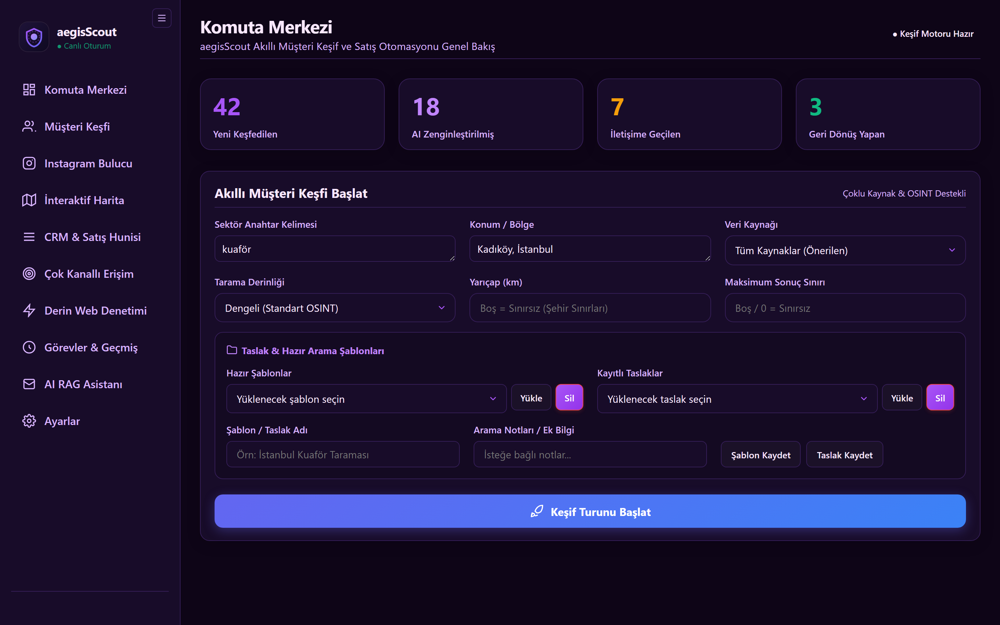
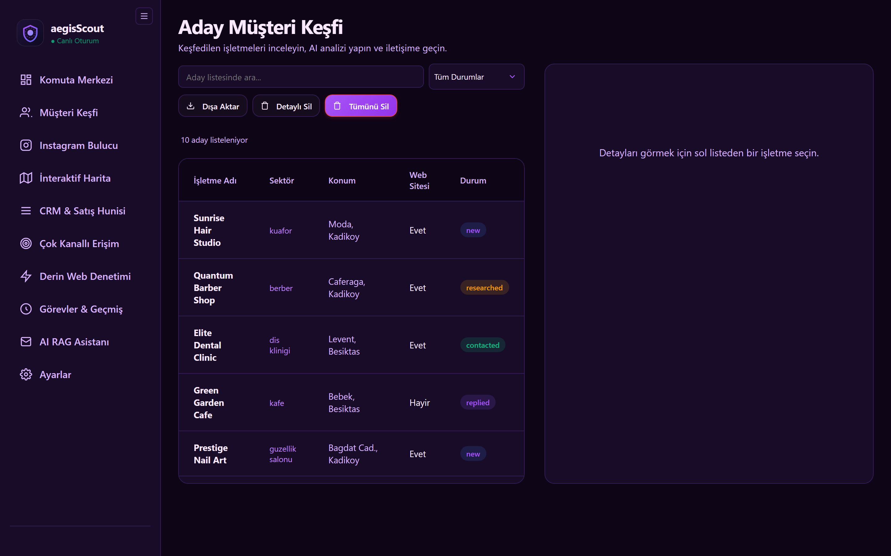
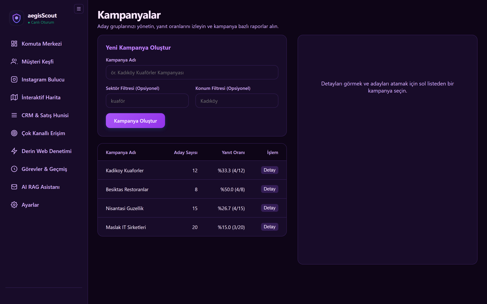
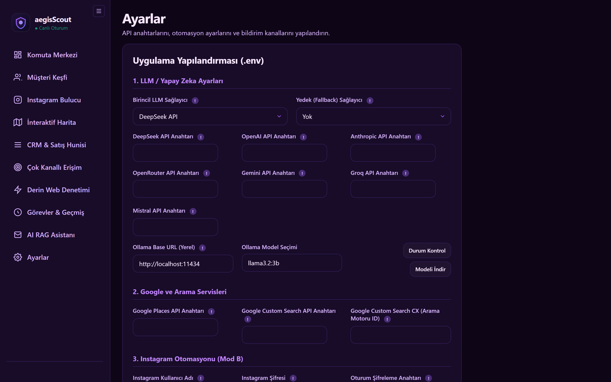

# aegisScout — İşletme Keşif, OSINT Analiz ve Satış Otomasyonu / Business Discovery, OSINT Intelligence & Client Acquisition

[](LICENSE)
[](https://www.python.org/)

---

### 🌐 Dil Seçimi / Language Selection
-  **[Bölüm 1: Türkçe Kullanım ve Teknik Dokümantasyon](#-bölüm-1-türkçe-kullanim-ve-teknik-dokümantasyon)**
-  **[Section 2: English User Guide & Technical Documentation](#-section-2-english-user-guide--technical-documentation)**

---

## 🖼️ Masaüstü Arayüzü Ekran Görüntüleri / Desktop UI Screenshots

Uygulama masaüstü arayüzüne ait canlı panel görüntüleri (Tüm veriler temsilidir / All sample data shown is placeholder):

### 📊 Dashboard & Keşif Radarı / Discovery Radar


### 📋 Müşteri Adayları Yöneticisi / Leads Manager


### 🎯 Kampanya Yöneticisi / Campaigns Manager


### ⚙️ Ayarlar ve Yapılandırma Paneli / Settings Panel


---
---

#  BÖLÜM 1: TÜRKÇE KULLANIM VE TEKNİK DOKÜMANTASYON

## 📌 Proje Hakkında

**aegisScout**; web tasarımı, yazılım geliştirme, dijital pazarlama ve SEO hizmeti sunan ajanslar ile freelancerlar için özel olarak geliştirilmiş, **kendi bilgisayarınızda çalışan (self-hosted)**, %100 yerel ve gizlilik odaklı bir potansiyel müşteri keşfi, açık kaynak istihbarat (OSINT) zenginleştirmesi, yapay zeka destekli kişiselleştirilmiş teklif üretimi ve çok kanallı iletişim otomasyon platformudur.

---

## ✨ Tüm Platform Özellikleri

### 1. İşletme Keşif Motoru & Sıfır-Key OSINT Çerçevesi

- **Harita, Geocoding ve Konum Zenginleştirme:**
  - **OpenStreetMap (OSM) & Overpass API:** Harici bir API anahtarı veya ödeme gerektirmeden sektor ve bölge bazlı sınırsız işletme taraması yapabilir.
  - **Komoot Photon API (`photon.komoot.io`):** Adres ve coğrafi koordinat dönüşümlerini (geocoding) sıfır API anahtarı ile canlı gerçekleştirir.
  - **BigDataCloud & Country.is:** İstemci taraflı ters geocoding (reverse geocoding) ve IP bazlı konum tespiti sunar.
  - **Google Places API & SerpApi Local 3-Pack:** İsteğe bağlı olarak Google Haritalar ve Yerel 3'lü Harita Paketi verilerini çeker; API anahtarı bulunmadığında otomatik olarak ücretsiz web kazıma servislerine düşer.

- **Sıfır-Key Derin Açık Kaynak İstihbaratı (OSINT):**
  - **ICANN RDAP (`rdap.org`):** Alan adı tescil yaşını, tescil firmasını (registrar) ve WHOIS verilerini sorgular.
  - **Cloudflare DNS-over-HTTPS (`1.1.1.1`):** Hedef işletmenin e-posta altyapısını (Google Workspace, Microsoft 365, cPanel, ProtonMail) ve SPF/DMARC e-posta güvenlik kayıtlarını denetler.
  - **Shodan InternetDB (`internetdb.shodan.io`):** Sunucudaki açık portları, bilinen güvenlik zafiyetlerini (CVE) ve sistem etiketlerini API anahtarsız tespit eder.
  - **crt.sh Sertifika Madenciliği:** SSL/TLS şeffaflık günlüklerinden (Certificate Transparency) işletmeye ait alt alan adlarını (subdomain) çıkarır.
  - **Mozilla Observatory & Wayback Machine:** Web güvenlik uyumluluk skorlarını ve geçmiş site arşivlerini denetler.
  - **IP-API & Ipify:** Sunucu IP adresini, veri merkezi sağlayıcısını ve coğrafi konumunu belirler.

- **Görsel Zenginleştirme Servisleri:**
  - **Google Favicon API & Unavatar:** 128x128 çözünürlükte kurumsal logoları ve sosyal medya profil resimlerini otomatik olarak çeker.
  - **UI-Avatars, Microlink & Thum.io:** Dinamik renkli harf ikonları, OpenGraph özet kartları ve canlı mobil/masaüstü web sitesi önizlemeleri üretir.

---

### 2. Kademeli Zenginleştirme (Waterfall Enrichment) & Çok Kanallı Temas Noktaları

- **Kademeli E-posta Keşif Şelalesi (Waterfall Cascade):**
  1. **Derin Web Scraping:** Hedef web sitesinin tüm alt sayfalarını tarayarak iletişim e-postalarını ve formları tespit eder.
  2. **Arama Motoru Sorgusu:** Google ve DuckDuckGo indexleri üzerinden işletmeye ait kamuya açık e-postaları sorgular.
  3. **Sosyal Medya Biyo Kazıma:** Instagram, Facebook ve LinkedIn biyografi alanlarından e-posta ve iletişim verilerini çıkarır.
  4. **Akıllı Erken Çıkış (Early Exit):** E-posta adresi herhangi bir aşamada bulunduğunda sonraki adımlar atlanarak ağ trafiği ve kota tasarrufu sağlanır.

- **Sosyal Medya İletişim Taraması:**
  - Web siteleri ve açık kaynaklardan Instagram, Facebook, LinkedIn, Twitter/X, TikTok, Telegram, YouTube, GitHub, Medium, Substack, Behance, Dribbble, Snapchat, Spotify ve Twitch hesaplarını otomatik olarak tespit eder ve işletme profili ile eşleştirir.

- **Telefon ve Veri Sızıntısı Analizi (Phone & Breach Intel):**
  - **Yerel Telefon Doğrulama:** `phonenumbers` kütüphanesi ile offline operatör, ülke kodu ve biçimlendirme doğrulaması yapar; doğrudan WhatsApp (`wa.me`) ve Telegram (`t.me`) erişim bağlantıları oluşturur.
  - **Veri Sızıntısı Denetimi:** HIBP Pwned Passwords ve XposedOrNot servisleri ile e-posta adreslerinin kamuya açık veri ihlallerinde yer alıp almadığını sorgular.

---

### 3. Yerel E-posta Doğrulama ve Teslim Edilebilirlik Motoru (Deliverability)

- **4 Aşamalı Doğrulama Hattı:**
  1. **Söz Dizimi (Regex) Denetimi:** E-posta adresinin RFC standartlarına uygunluğunu doğrular.
  2. **Geçici (Disposable) Domain Tespiti:** 30'dan fazla bilinen tek kullanımlık e-posta sağlayıcısını engeller (`data/disposable_domains.txt` ile genişletilebilir).
  3. **DNS MX Kaydı Sorgulaması:** Domainin aktif e-posta alma sunucularını kontrol eder.
  4. **Socket Tabanlı SMTP Handshake Simülasyonu:** Gerçek e-posta göndermeden `HELO`, `MAIL FROM`, `RCPT TO` komutlarıyla e-posta kutusunun sunucuda var olduğunu yerel olarak doğrular.
- **%100 Ücretsiz ve API Anahtarsız:** Tüm doğrulama süreci doğrudan Python socket ve dnspython kütüphaneleriyle yerel olarak yürütülür.

---

### 4. Görsel ve Teknik Web Denetimi (Multimodal Screen Audit & Design Intelligence)

- **Playwright ile Görsel Yakalama:** Hedef işletmenin web sitesini headless Chromium tarayıcısı ile masaüstü çözünürlüğünde kaydeder.
- **Gemini Vision AI Yapay Zeka Analizi:** Web sitesi ekran görüntüsünü yapay zeka ile inceleyerek mobil uyumluluk hatalarını, renk kontrastı yetersizliklerini, tipografi ve hizalama sorunlarını, eksik Call-to-Action (CTA) butonlarını tespit eder.
- **Yerel Sezgisel Skorlama:** Gemini API bulunmadığı durumlarda sayfa açılış hızı, kırık bağlantılar ve SEO etiket eksiklikleri üzerinden **100 üzerinden Web Sitesi Kalite Skoru** hesaplar.
- **Satış Kancası Üretimi (Outreach Hook):** Tespit edilen tasarım ve teknik eksikliklere dayalı, yüksek dönüşüm oranına sahip kişiselleştirilmiş ilk temas cümleleri oluşturur.

---

### 5. Çoklu-Ajan AI Metin Yazarı (Multi-Agent Copywriter) & Yerel RAG Bilgi Tabanı

- **3 Ajanlı Yapay Zeka İş Akışı:**
  - **Inspector (Denetçi):** İşletmenin teknik, tasarım ve dijital pazarlama fırsatlarını analiz eder.
  - **Copywriter (Yazar):** İşletmeye özel teklif, e-posta ve mesaj taslaklarını kaleme alır.
  - **Editor (Editör):** Yapay zeka jargonunu, klişe selamlaşmaları ve yapay verileri temizleyerek metni doğal insan diline çevirir.

- **Yerel RAG (Retrieval-Augmented Generation) Bilgi Tabanı:**
  - `data/knowledge_base/` klasöründeki `.txt`, `.md` ve `.pdf` formatındaki portföy, başarı hikayesi ve referans dosyalarını tarar ve indeksler.
  - **Çift Motorlu Arama:** İnternetsiz çalışan yerel TF-IDF Benzerliği ve opsiyonel Vektör Embedding (Ollama / Gemini API) ile akıllı referans araması yapar.

- **Özel Ürün Fikirleri Motoru:**
  - Keşfedilen her işletme için Türkiye pazarına uygun TL fiyat tahminli 2-3 adet özel yazılım/dijital ürün fikri, satış kancası ve müşteri itirazlarına yanıtlar üretir.

---

### 6. Akıllı Yapay Zeka Yönlendirici (Multi-LLM Router) & Kota Yönetimi

- **Desteklenen Yapay Zeka Sağlayıcıları:**
  - **OpenRouter API** (Açık kaynak ve ticari onlarca modele tek anahtarla erişim)
  - **Google Gemini API** (Gemini 2.5 Flash ile yüksek hızlı içerik üretimi)
  - **Groq API** (Llama-3.3-70b ile ultra düşük gecikmeli analiz)
  - **Mistral AI API** (Mistral Large ile kurumsal akıl yürütme)
  - **DeepSeek API** (Maliyet etkin derin analiz)
  - **OpenAI API** (GPT-4o & GPT-4o mini)
  - **Anthropic Claude API** (Claude 3.5 Haiku)
  - **Ollama** (Tamamen yerel, çevrimdışı ve ücretsiz LLM desteği)

- **Otomatik Yedekleme (Failover Routing) ve API Key Rotasyonu:**
  - Virgülle ayrılmış birden fazla API anahtarını sırayla döndürür. Birincil sağlayıcıda kesinti veya kota sınırı yaşandığında sistem otomatik olarak ikincil yedek sağlayıcıya geçer.

---

### 7. Çok Kanallı İletişim ve Otomasyon Modları

- **Mod A (Yardımcı Erişim — Varsayılan & %100 Güvenli):**
  - Yapay zeka tarafından üretilen kişiselleştirilmiş mesajı panoya kopyalar ve tek tıkla işletmenin Instagram DM veya WhatsApp tarayıcı sayfasını açar.
- **Mod B (Tam Otomasyon — Opsiyonel):**
  - Simüle edilmiş Instagram API (`instagrapi`) kullanarak veritabanı üzerinden oturum açar ve belirlenen günlük limitler dahilinde otomatik direkt mesaj gönderir.
- **WhatsApp Web ve LinkedIn Playwright Otomasyonu:**
  - Kalıcı tarayıcı profilleri (persistent context) kullanarak WhatsApp Web üzerinden mesaj gönderir ve LinkedIn üzerinde otomatik bağlantı isteği ("Connect") oluşturur.

---

### 8. SMTP Hesap Havuzu, Takip Dizileri (Sequences) ve E-posta Isıtma (Warmup)

- **SMTP Havuzu ve Saatlik Gönderim Limitleri:**
  - Veritabanındaki SMTP hesapları arasında otomatik yük dağıtımı yapar; hesap başına saatlik maksimum 5 e-posta gönderim limiti uygular. Şifreler veritabanında AES-256 Fernet ile saklanır.
- **Çok Aşamalı Soğuk E-posta Dizileri:**
  - İlk e-posta, 1. Takip (3 gün sonra) ve 2. Takip (7 gün sonra) şeklinde yapılandırılabilir takip zinciri çalıştırır. Gelen yanıt algılandığında takip e-postaları otomatik olarak durdurulur.
- **P2P E-posta Isıtma Motoru (Warmup):**
  - Tanımlı SMTP hesapları arasında doğal dilde e-posta trafiği simüle eder. IMAP üzerinden Spam/Junk klasörlerini tarayarak düşen mesajları Gelen Kutusu'na taşır, okundu işaretler ve alan adı itibarını yükseltir.

---

### 9. Arka Plan Görev Kuyruğu & Zamanlanmış Görev Motoru (Cron)

- **Async Task Queue:** Tüm arka plan işlemlerini (tarama, analiz, gönderim) tek bir event loop üzerinde `pending -> running -> completed / failed` durumlarıyla yönetir. Görevler duraklatılabilir veya iptal edilebilir.
- **Zamanlayıcı (Cron Manager):** Düzenli müşteri keşfi, otomatik takip e-postaları ve gelen kutusu denetimlerini belirlenen zaman aralıklarında otomatik çalıştırır.

---

### 10. Modern Masaüstü Grafik Arayüzü & SQLite WAL Veritabanı

- **PyWebView Tabanlı Dark Mode GUI:** Pürüzsüz geçişlere sahip modern masaüstü arayüzü. Parametresiz çalıştırıldığında konsol pencerelerini gizleyerek yerel pencere olarak açılır.
- **9 Dilde Tam i18n Desteği:** Türkçe, İngilizce, Almanca, İspanyolca, Fransızca, Arapça, Çince, Rusça ve Hintçe arayüz metinleri. Arapça dilinde otomatik RTL (sağdan sola) düzen.
- **SQLite WAL & SingletonPool / NullPool:** `PRAGMA journal_mode=WAL;` ve bağlantı havuzu optimizasyonları ile veritabanı kilitlenmelerini sıfıra indirir.

---

## 🔒 Güvenlik, Gizlilik ve Sıkılaştırma

- **%100 Yerel Veri Depolama:** Tüm veriler, aday listeleri, veritabanı kayıtları ve ayarlar sadece sizin bilgisayarınızdaki SQLite veritabanında (`data/aegisScout.db`) saklanır.
- **Gizli Anahtar Sınırı (Secrets Boundary):** PyWebView JS köprüsüne hiçbir API anahtarı veya şifre sızdırılmaz. Form verileri doğrudan `.env` dosyasına yazılır.
- **AES-256 Fernet Şifreleme:** Oturum verileri, SMTP şifreleri ve hassas kimlik bilgileri AES-256 Fernet jetonları ile veritabanında şifrelenir.

---

## 🛠️ Kurulum ve Yapılandırma

### 1. Gereksinimler
- **Python 3.11** veya üzeri
- `uv` paket yöneticisi (Önerilen hızlı kurulum aracı)

### 2. Kurulum Adımları

```bash
# Depoyu klonlayın ve proje dizinine gidin
git clone https://github.com/MrSpy00/aegisScout.git
cd aegisScout

# Temel Kurulum (Mod A - Yardımcı Erişim)
uv sync

# Masaüstü Grafik Arayüzü (GUI) dahil kurulum
uv sync --extra gui

# Tam Otomasyon (Mod B) dahil kurulum
uv sync --extra mod-b

# Geliştirici paketi dahil tam kurulum
uv sync --extra dev
```

> **Alternatif Pip Kurulumu:** `pip install -e .`

### 3. Yapılandırma Dosyaları
1. `.env` dosyasını oluşturun:
   ```bash
   copy .env.example .env
   ```
2. `.env` dosyasını düzenleyerek ilgili API anahtarlarınızı ekleyin.
3. `config.toml` dosyasını yapılandırın:
   ```bash
   copy config\config.example.toml config\config.toml
   ```

---

## 💻 Kullanım Kılavuzu (CLI & GUI)

### Masaüstü Uygulamasını Başlatma
Doğrudan GUI ekranını açmak için executable dosyasına çift tıklayın veya terminalde parametresiz çalıştırın:
```bash
python src/aegisScout/main.py
# Veya derlenmiş EXE:
dist/aegisScout.exe
```

### CLI Komutları

```bash
# 1. İşletme Keşfetme
aegisScout discover --sector "kuaför" --location "Kadıköy, İstanbul" --radius 5

# 2. Kampanya Yönetimi
aegisScout campaign create --name "Kadıköy Salonları" --sector "kuaför" --location "Kadıköy"
aegisScout campaign list
aegisScout campaign assign --campaign-id 1 --auto-filter

# 3. Müşteri Araştırma ve AI Analizi
aegisScout research --lead-id 1
aegisScout research --lead-id 1 --force

# 4. İnceleme ve İletişim
aegisScout review
aegisScout send --lead-id 1

# 5. Waterfall E-posta Zenginleştirme
aegisScout waterfall --lead-id 1

# 6. Web Görsel Denetimi (Multimodal Audit)
aegisScout audit --lead-id 1

# 7. E-posta Doğrulama (Local SMTP Handshake)
aegisScout verify "ornek@firma.com"

# 8. E-posta Isıtma (P2P Warmup)
aegisScout warmup

# 9. Arka Plan Görev Yönetimi
aegisScout tasks list
aegisScout tasks cancel <task_id>

# 10. Verileri Dışa Aktarma
aegisScout export --output data/exports/leads.csv
```

---

## ⚖️ Kullanım Şartları ve Yasal Uyarı

- **Instagram ToS Uyarısı:** Mod B (Tam Otomasyon) özelliğinin kullanımı Meta/Instagram Kullanım Koşullarını ihlal edebilir. Hesap güvenliği için günlük limitlere uyulması (maks. 15-20 DM/gün) ve yedek hesaplar kullanılması önerilir.
- **Yasal Uyum (KVKK & İYS & GDPR):** Toplanan verilerin işlenmesi ve soğuk e-posta gönderimi aşamalarında Kişisel Verilerin Korunması Kanunu (KVKK), İleti Yönetim Sistemi (İYS) ve ilgili veri koruma mevzuatına uyulması kullanıcının sorumluluğundadır.

---
---

#  SECTION 2: ENGLISH USER GUIDE & TECHNICAL DOCUMENTATION

## 📌 About the Project

**aegisScout** is a modern, **self-hosted**, 100% private and local business discovery, deep OSINT enrichment, AI copywriting, and multi-channel outreach automation platform built specifically for web agencies, freelancers, software houses, and digital marketing professionals.

---

## ✨ Full Platform Features

### 1. Business Discovery Engine & Zero-Key OSINT Framework

- **Geocoding & Location Intelligence:**
  - **OpenStreetMap (OSM) & Overpass API:** Unlimited sector and location business discovery without requiring external API keys.
  - **Komoot Photon API (`photon.komoot.io`):** Performs real-time address geocoding and coordinate resolution with zero key requirement.
  - **BigDataCloud & Country.is:** Provides client-side reverse geocoding and IP-based geolocation detection.
  - **Google Places API & SerpApi Local 3-Pack:** Optional integration for Google Maps and Local 3-Pack data; automatically falls back to free web scrapers when API keys are absent.

- **Zero-Key Deep OSINT Services:**
  - **ICANN RDAP (`rdap.org`):** Fetches domain registration age, registrar details, and WHOIS information.
  - **Cloudflare DNS-over-HTTPS (`1.1.1.1`):** Analyzes target MX infrastructure (Google Workspace, Microsoft 365, cPanel, ProtonMail) and audits SPF/DMARC security configurations.
  - **Shodan InternetDB (`internetdb.shodan.io`):** Detects open ports, known CVE vulnerabilities, and server tags without an API key.
  - **crt.sh Certificate Mining:** Extracts target subdomains from public SSL/TLS Certificate Transparency logs.
  - **Mozilla Observatory & Wayback Machine:** Queries web security compliance scores and historical site archives.
  - **IP-API & Ipify:** Identifies server IP address, hosting provider, ISP, and geographical datacenter location.

- **Visual Enrichment:**
  - **Google Favicon API & Unavatar:** Fetches 128x128 corporate logos and multi-platform social media avatars automatically.
  - **UI-Avatars, Microlink & Thum.io:** Generates dynamic colored initials, OpenGraph summaries, and real-time mobile/desktop site preview cards.

---

### 2. Multi-Channel Contact Discovery & Waterfall Enrichment

- **Waterfall Email Discovery Cascade:**
  1. **Website Scraping:** Deep-crawls target web pages to locate contact emails, phone numbers, and contact forms.
  2. **Search Engine Query:** Executes fallback search queries via Google and DuckDuckGo for public contact listings.
  3. **Social Bio Scraping:** Extracts contact details directly from Instagram, Facebook, and LinkedIn bios.
  4. **Smart Early Exit:** If a valid email is found at any stage, subsequent steps are skipped to conserve network bandwidth and API credits.

- **Deep Social Touchpoint Mining:**
  - Automatically identifies and matches social profiles across 15+ networks: Instagram, Facebook, LinkedIn, Twitter/X, TikTok, Telegram, YouTube, GitHub, Medium, Substack, Behance, Dribbble, Snapchat, Spotify, and Twitch.

- **Phone & Breach Intelligence:**
  - **Offline Phone Validation:** Uses `phonenumbers` for offline carrier, country code, and format validation; generates direct WhatsApp (`wa.me`) and Telegram (`t.me`) action links.
  - **Breach Audit:** Queries HIBP Pwned Passwords and XposedOrNot APIs to check whether corporate emails have appeared in public data breaches.

---

### 3. Local Email Verification & Deliverability Engine

- **4-Stage Local Validation Pipeline:**
  1. **Regex Syntax Check:** Validates email format against standard RFC specifications.
  2. **Disposable Domain Filtering:** Blocks 30+ known disposable and temporary email providers (extendable via `data/disposable_domains.txt`).
  3. **DNS MX Record Resolution:** Verifies active mail exchange server records for the domain.
  4. **Socket-Level SMTP Handshake Simulation:** Simulates `HELO`, `MAIL FROM`, and `RCPT TO` commands to verify mailbox existence without sending actual emails.
- **100% Free & Zero-API:** Operates entirely locally using native Python sockets and dnspython.

---

### 4. Multimodal Screen Audit & Design Intelligence

- **Playwright Automated Capture:** Takes desktop screenshots of target websites using headless Chromium and stores them locally.
- **Gemini Vision AI Analysis:** Analyzes web screenshots using multimodal vision AI to detect mobile responsiveness flaws, color contrast issues, typography hierarchy errors, and missing Call-to-Action (CTA) elements.
- **Local Heuristic Scoring:** When Vision API is unconfigured, computes a **100-point Website Quality Score** based on page load performance, broken link rates, and meta tag completeness.
- **Outreach Hook Generation:** Crafts high-converting, personalized conversation starters based on specific visual and technical issues discovered during the audit.

---

### 5. Multi-Agent AI Copywriter & Local RAG Knowledge Base

- **3-Agent AI Workflow:**
  - **Inspector:** Analyzes technical gaps, design flaws, and business opportunities.
  - **Copywriter:** Generates customized value propositions and outreach email drafts tailored to the target lead.
  - **Editor:** Strips generic AI jargon, robotic salutations, and unverified data to produce natural, human-sounding outreach messages.

- **Local RAG (Retrieval-Augmented Generation) Knowledge Base:**
  - Scans and indexes local `.txt`, `.md`, and `.pdf` files inside `data/knowledge_base/` containing portfolio items and case studies.
  - **Dual Engine Search:** Features offline TF-IDF Cosine Similarity and optional semantic vector embeddings via Ollama or Gemini API.

- **Product Ideation Engine:**
  - Generates 2-3 tailored digital product ideas, pitch hooks, and objection handlers customized for each target business profile.

---

### 6. Multi-LLM Router Architecture & Rate Limiting

- **Supported AI Providers:**
  - **OpenRouter API** (Access dozens of commercial and open-source models seamlessly)
  - **Google Gemini API** (High-speed analysis via Gemini 2.5 Flash)
  - **Groq API** (Ultra-low latency generation via Llama-3.3-70b)
  - **Mistral AI API** (Enterprise reasoning via Mistral Large)
  - **DeepSeek API** (Cost-effective deep reasoning)
  - **OpenAI API** (GPT-4o & GPT-4o mini)
  - **Anthropic Claude API** (Claude 3.5 Haiku)
  - **Ollama** (Fully offline, private, and free local LLM support)

- **Failover Routing & Key Rotation:**
  - Rotates multiple comma-separated API keys automatically. Automatically redirects requests to a secondary fallback provider if the primary service experiences outages or rate limits.

---

### 7. Outreach Engine & Multi-Channel Automation

- **Mode A (Assisted Outreach — Default & 100% Safe):**
  - Copies personalized AI drafts to your system clipboard and opens the lead's Instagram DM or WhatsApp Web profile in your default browser with a single click.
- **Mode B (Direct Automation — Optional):**
  - Logs into Instagram via simulated API (`instagrapi`) and sends direct messages directly from the database within configured daily rate limits.
- **WhatsApp Web & LinkedIn Automation:**
  - Employs Playwright persistent context browser profiles to automate messaging via WhatsApp Web and send connection requests ("Connect") with personalized notes on LinkedIn.

---

### 8. SMTP Pool, Multi-Stage Sequences & P2P Warmup Engine

- **SMTP Pool & Hourly Rate Control:**
  - Balances sending load across multiple configured SMTP accounts with strict limits (default: max 5 emails/hour per account). All credentials are encrypted with AES-256 Fernet.
- **Multi-Stage Cold Email Sequences:**
  - Runs automated sequence chains: Initial Email -> Follow-up 1 (after 3 days) -> Follow-up 2 (after 7 days). Follow-up sequence is automatically halted when an inbound reply is detected.
- **P2P Email Warmup Engine:**
  - Simulates natural email exchanges between configured accounts. Automatically monitors IMAP Spam/Junk folders, rescues landed emails to the Inbox, marks them as read, and improves overall domain deliverability.

---

### 9. Async Task Queue & Cron Scheduler

- **Async Task Queue:** Manages background execution (scraping, auditing, sending) via a single event loop transitioning through `pending -> running -> completed / failed` states with pause/cancel controls.
- **Cron Scheduler:** Periodically executes scheduled discovery routines, automated follow-up sequences, and inbox audits at specified time intervals.

---

### 10. Modern Desktop GUI & SQLite WAL Engine

- **PyWebView Dark Mode Dashboard:** Sleek, responsive desktop application. When launched without CLI arguments, console terminal windows are hidden automatically.
- **9-Language Complete i18n:** Built-in internationalization supporting English, Turkish, German, Spanish, French, Arabic (with automatic RTL layout), Chinese, Russian, and Hindi.
- **SQLite WAL Mode & Connection Pool:** Implements `PRAGMA journal_mode=WAL;` and SingletonPool / NullPool engine configurations to prevent database deadlocks and read/write latency.

---

## 🔒 Security, Privacy & Hardening

- **100% Local Data Storage:** All leads, credentials, settings, and conversation logs remain exclusively inside your local SQLite database (`data/aegisScout.db`).
- **Secrets Boundary:** API keys and passwords are never exposed to the JavaScript PyWebView bridge. Settings forms save keys directly to `.env`.
- **AES-256 Fernet Encryption:** Session tokens, passwords, and sensitive credentials are encrypted using AES-256 Fernet tokens prior to database persistence.

---

## 🛠️ Installation & Setup

### 1. Requirements
- **Python 3.11** or higher
- `uv` package manager (recommended for fast installation)

### 2. Installation Commands

```bash
# Clone repository and enter directory
git clone https://github.com/MrSpy00/aegisScout.git
cd aegisScout

# Basic Installation (Mode A - Assisted Outreach)
uv sync

# Install with Desktop GUI Dashboard
uv sync --extra gui

# Install with Full Automation (Mode B)
uv sync --extra mod-b

# Install with Developer & Testing Dependencies
uv sync --extra dev
```

> **Alternative Pip Install:** `pip install -e .`

### 3. Environment Configuration
1. Create a local `.env` file:
   ```bash
   copy .env.example .env
   ```
2. Fill in your API keys in `.env`.
3. Create your `config.toml`:
   ```bash
   copy config\config.example.toml config\config.toml
   ```

---

## 💻 Usage Guide (CLI & GUI)

### Launching Desktop Application
To launch the desktop GUI, double-click the executable or run main without arguments:
```bash
python src/aegisScout/main.py
# Or compiled executable:
dist/aegisScout.exe
```

### Essential CLI Commands

```bash
# 1. Discover Businesses
aegisScout discover --sector "barber" --location "London, UK" --radius 5

# 2. Campaign Management
aegisScout campaign create --name "London Salons" --sector "barber" --location "London"
aegisScout campaign list
aegisScout campaign assign --campaign-id 1 --auto-filter

# 3. Lead Research & AI Analysis
aegisScout research --lead-id 1
aegisScout research --lead-id 1 --force

# 4. Review & Outreach
aegisScout review
aegisScout send --lead-id 1

# 5. Waterfall Email Enrichment
aegisScout waterfall --lead-id 1

# 6. Web Visual Audit (Multimodal Audit)
aegisScout audit --lead-id 1

# 7. Email Verification (Local SMTP Handshake)
aegisScout verify "user@example.com"

# 8. P2P Email Warmup
aegisScout warmup

# 9. Background Task Management
aegisScout tasks list
aegisScout tasks cancel <task_id>

# 10. Data Export
aegisScout export --output data/exports/leads.csv
```

---

## ⚖️ Terms of Use & Legal Compliance

- **Instagram ToS Warning:** Using Mode B (Full Automation) may violate Meta/Instagram Terms of Service. Account safety requires observing daily rate limits (max 15-20 DMs/day) and utilizing secondary accounts.
- **Regulatory Compliance (GDPR, CAN-SPAM, KVKK):** The user is responsible for ensuring compliance with applicable data privacy and anti-spam legislation when harvesting public business details and initiating direct cold communication.

---

## 📄 License

This project is licensed under the **MIT License**. See the [LICENSE](LICENSE) file for details.
